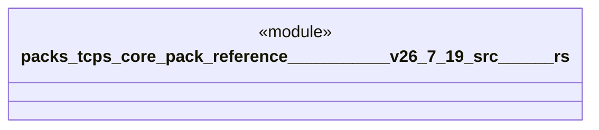

# `packs/tcps-core-pack/reference/豊田コード生産方式_v26.7.19/src/人間中心.rs`

Source SHA-256: `9896cb4159b7e1a44f5bde91c4c9001d8d9b62fbddd51b08a044a17c5b84bf78`

## Dependencies

- None observed.

## Standing

- Structural parse: `ALIVE`
- Runtime behavior: `UNKNOWN`
