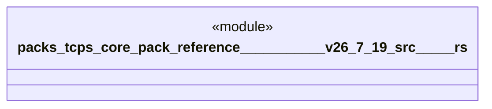

# `packs/tcps-core-pack/reference/豊田コード生産方式_v26.7.19/src/価値流.rs`

Source SHA-256: `e5a2dc637874e9e739b8d01f527784e4d3537ee59b02cd9928df413d38687d20`

## Dependencies

- `crate::語彙::{工程番号, 成否, 有無}`

## Standing

- Structural parse: `ALIVE`
- Runtime behavior: `UNKNOWN`
