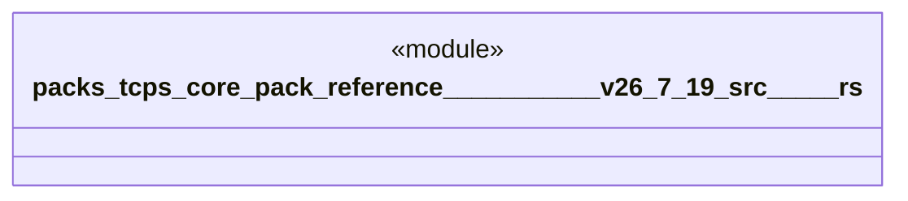

# `packs/tcps-core-pack/reference/豊田コード生産方式_v26.7.19/src/受領証.rs`

Source SHA-256: `5b4094e3c493f28b3ff55621209b1593af5b75b4a542e1bb2a874a0b3882dcbf`

## Dependencies

- `crate::品質::異常`
- `crate::語彙::{受領番号, 工程番号, 時刻, 有無, 標準番号, 道具番号, 理由番号}`

## Standing

- Structural parse: `ALIVE`
- Runtime behavior: `UNKNOWN`
