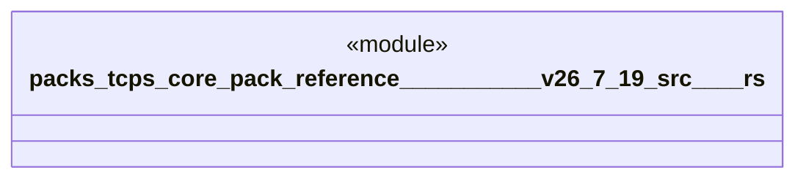

# `packs/tcps-core-pack/reference/豊田コード生産方式_v26.7.19/src/品質.rs`

Source SHA-256: `2c1e6ed0be02ae74cc99b6c541a60909d6e691539d511be984b163f9876a6f64`

## Dependencies

- `crate::語彙::{工程番号, 数量, 時刻}`

## Standing

- Structural parse: `ALIVE`
- Runtime behavior: `UNKNOWN`
