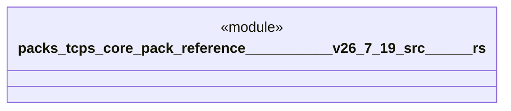

# `packs/tcps-core-pack/reference/豊田コード生産方式_v26.7.19/src/工程能力.rs`

Source SHA-256: `00568894981d9711839255e3cfa87f76bc0a24962a178827006e5d83598b7f39`

## Dependencies

- `crate::語彙::{数量, 周期, 成否}`

## Standing

- Structural parse: `ALIVE`
- Runtime behavior: `UNKNOWN`
