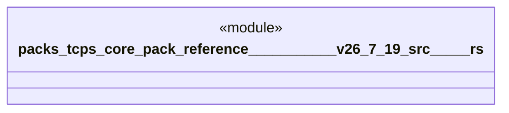

# `packs/tcps-core-pack/reference/豊田コード生産方式_v26.7.19/src/自働化.rs`

Source SHA-256: `93e7bc9333006597f550e64a9d64182dfb3cae32e7b27f9169944d46dae72629`

## Dependencies

- `core::marker::PhantomData as 状態印`
- `crate::品質::{品質判定, 異常票, 良品}`
- `crate::語彙::{工程番号, 数量, 時刻}`

## Standing

- Structural parse: `ALIVE`
- Runtime behavior: `UNKNOWN`
