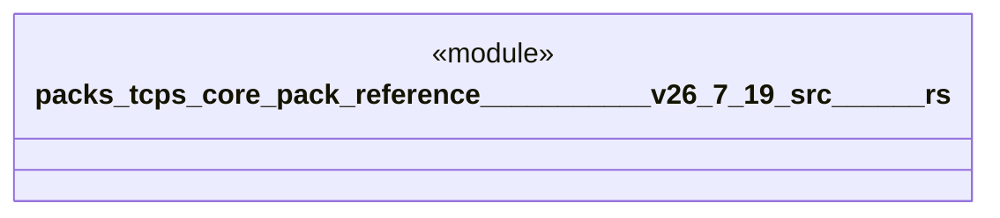

# `packs/tcps-core-pack/reference/豊田コード生産方式_v26.7.19/src/自動選択.rs`

Source SHA-256: `96a0a23b59fc9ce8660060e5a023a628cab09e4294d2df28effe8c6064f2ac23`

## Dependencies

- `crate::受領証::{簡易要約, 受領種別, 受領証, 要約値}`
- `crate::語彙::{方策番号, 時刻, 有無, 権限印, 準備印, 理由番号, 質量, 道具番号, 適格印, 経路番号}`

## Standing

- Structural parse: `ALIVE`
- Runtime behavior: `UNKNOWN`
