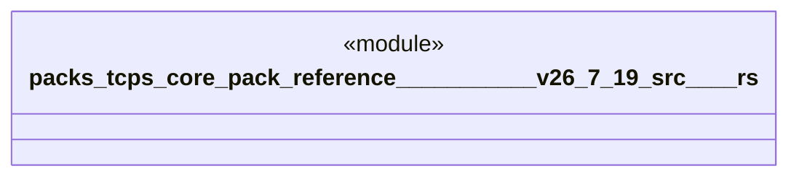

# `packs/tcps-core-pack/reference/豊田コード生産方式_v26.7.19/src/試験.rs`

Source SHA-256: `f55b775d7504b49643c3991081f5bdde83ec3bb87cbaaaf6700089b46f8c27e6`

## Dependencies

- `crate::*`

## Standing

- Structural parse: `ALIVE`
- Runtime behavior: `UNKNOWN`
