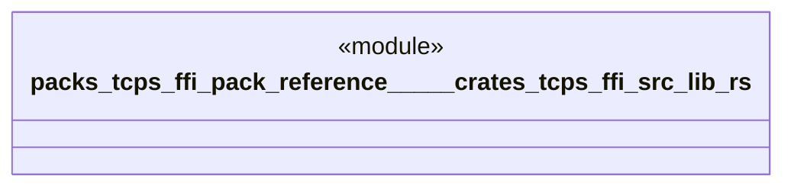

# `packs/tcps-ffi-pack/reference/製品版/crates/tcps-ffi/src/lib.rs`

Source SHA-256: `776bad723261af9377f3d22b276bd185f2f239777922439df1f5bff3fbf9edd0`

## Dependencies

- `tcps_core::正準::正準方策`
- `tcps_core::自動選択::{作業領域, 拒否理由, 選択する, 選択結果, 選択要求}`
- `tcps_core::語彙::有無`

## Standing

- Structural parse: `ALIVE`
- Runtime behavior: `UNKNOWN`
