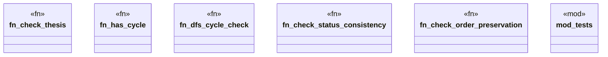

# `playground/src/checker.rs`

Source SHA-256: `c11948667700e0fd2d93048b975bc085cc5c994ac86e03dcf2024140869d57c4`

## Dependencies

- `crate::Result`
- `crate::models::*`
- `crate::ontology`
- `std::collections::{HashMap, HashSet}`
- `super::*`

## Standing

- Structural parse: `ALIVE`
- Runtime behavior: `UNKNOWN`
