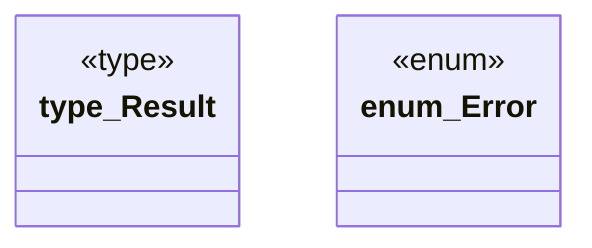

# `playground/src/error.rs`

Source SHA-256: `15ee84e5e151ce1dc33c08fe3985162372f274108cd1635d4a17cbcd8236f8b9`

## Dependencies

- `thiserror::Error`

## Standing

- Structural parse: `ALIVE`
- Runtime behavior: `UNKNOWN`
