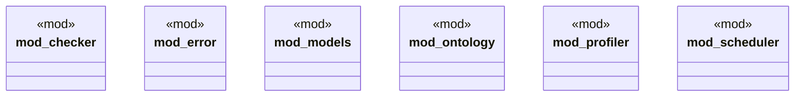

# `playground/src/lib.rs`

Source SHA-256: `39b102d33a380080ed01bc44aca3b17ca996e6e7a021e8056a4be69b14c61f26`

## Dependencies

- `error::{Error, Result}`
- `models::*`

## Standing

- Structural parse: `ALIVE`
- Runtime behavior: `UNKNOWN`
