# `playground/src/main.rs`

Source SHA-256: `c573a3f59a278c769d8f2a98301699171ae1396770ce339b452835bf05312eea`

```mermaid
classDiagram
    class mod_checker {
      <<mod>>
    }
    class mod_error {
      <<mod>>
    }
    class mod_models {
      <<mod>>
    }
    class mod_ontology {
      <<mod>>
    }
    class mod_profiler {
      <<mod>>
    }
    class mod_scheduler {
      <<mod>>
    }
    class struct_ScheduleOutput {
      <<struct>>
      +"thesis_id: String"
      +"chapters: usize"
      +"total_shards: usize"
      +"total_words: usize"
      +"chapters_detail: Vec~ChapterDetail~"
    }
    class struct_ChapterDetail {
      <<struct>>
      +"number: usize"
      +"title: String"
      +"shards: usize"
      +"words: usize"
      +"families: Vec~String~"
    }
    class struct_ProfileOutput {
      <<struct>>
      +"thesis_id: String"
      +"total_words: usize"
      +"total_shards: usize"
      +"coverage: HashMap~String"
      +"report: String"
    }
    class struct_CheckOutput {
      <<struct>>
      +"is_valid: bool"
      +"passed: Vec~String~"
      +"failed: Vec~String~"
      +"drift: Vec~String~"
      +"recommendations: Vec~String~"
    }
    class struct_AddOutput {
      <<struct>>
      +"shard_id: String"
      +"family: String"
      +"status: String"
    }
    class struct_ListOutput {
      <<struct>>
      +"shards: Vec~ShardDetail~"
      +"total: usize"
    }
    class struct_ShardDetail {
      <<struct>>
      +"id: String"
      +"name: String"
      +"family: String"
      +"status: String"
      +"words: usize"
    }
    class fn_sample_shards {
      <<fn>>
    }
    class fn_schedule {
      <<fn>>
    }
    class fn_profile {
      <<fn>>
    }
    class fn_check {
      <<fn>>
    }
    class fn_add {
      <<fn>>
    }
    class fn_list {
      <<fn>>
    }
    class fn_export {
      <<fn>>
    }
    class struct_Cli {
      <<struct>>
      +"command: Commands"
    }
    class enum_Commands {
      <<enum>>
    }
```

## Dependencies

- `clap::{Parser, Subcommand}`
- `clap_noun_verb::Result as NounVerbResult`
- `clap_noun_verb_macros::verb`
- `error::Result`
- `models::*`
- `serde::Serialize`
- `std::collections::HashMap`

## Standing

- Structural parse: `ALIVE`
- Runtime behavior: `UNKNOWN`
