# `playground/src/models.rs`

Source SHA-256: `cfb9281532d74c9486a02b449114b9ce0714abb0a9a8d60d31aff57a8e444737`

```mermaid
classDiagram
    class struct_DeltaShard {
      <<struct>>
      +"id: String"
      +"name: String"
      +"family: ShardFamily"
      +"content: String"
      +"status: ShardStatus"
      +"dependencies: Vec~String~"
    }
    class enum_ShardFamily {
      <<enum>>
    }
    class enum_ShardStatus {
      <<enum>>
    }
    class struct_LambdaOrder {
      <<struct>>
      +"shards: Vec~String~"
    }
    class struct_PiProfile {
      <<struct>>
      +"thesis_id: String"
      +"shards: HashMap~String"
      +"coverage: HashMap~ShardFamily"
      +"total_words: usize"
    }
    class struct_Invariant {
      <<struct>>
      +"name: String"
      +"description: String"
      +"constraint_type: ConstraintType"
    }
    class enum_ConstraintType {
      <<enum>>
    }
    class struct_GammaCheckResult {
      <<struct>>
      +"is_valid: bool"
      +"invariants_passed: Vec~String~"
      +"invariants_failed: Vec~String~"
      +"drift_detected: Vec~String~"
      +"recommendations: Vec~String~"
    }
    class struct_ChapterPlan {
      <<struct>>
      +"thesis_id: String"
      +"chapters: Vec~Chapter~"
    }
    class struct_Chapter {
      <<struct>>
      +"number: usize"
      +"title: String"
      +"shards: Vec~String~"
      +"estimated_words: usize"
      +"families: Vec~ShardFamily~"
    }
```

## Dependencies

- `serde::{Deserialize, Serialize}`
- `std::collections::HashMap`

## Standing

- Structural parse: `ALIVE`
- Runtime behavior: `UNKNOWN`
