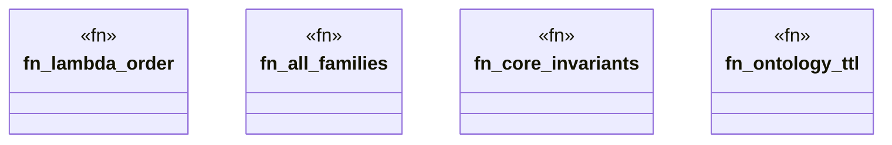

# `playground/src/ontology.rs`

Source SHA-256: `32e229fac228279a76cd4a356c248b4afbc4f4f1744a942a8fa618e1a389db16`

## Dependencies

- `crate::models::*`

## Standing

- Structural parse: `ALIVE`
- Runtime behavior: `UNKNOWN`
