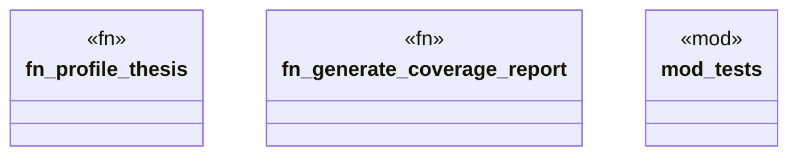

# `playground/src/profiler.rs`

Source SHA-256: `b6943214872215119b35a880295d986c9c775e6fb98c0d6ed2034006d906ee5c`

## Dependencies

- `crate::Result`
- `crate::models::*`
- `crate::ontology`
- `std::collections::HashMap`
- `super::*`

## Standing

- Structural parse: `ALIVE`
- Runtime behavior: `UNKNOWN`
