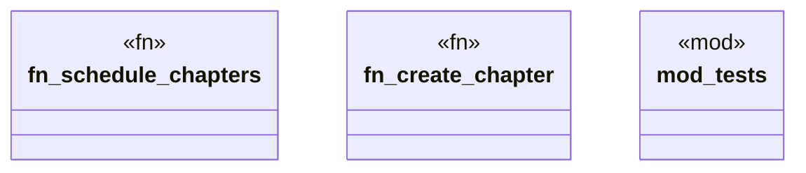

# `playground/src/scheduler.rs`

Source SHA-256: `102826b60c1595dc542fb1c3bf3aad49af173660e53dcd5cc6076d09bb2e7780`

## Dependencies

- `crate::Result`
- `crate::models::*`
- `crate::ontology`
- `std::collections::HashMap`
- `super::*`

## Standing

- Structural parse: `ALIVE`
- Runtime behavior: `UNKNOWN`
