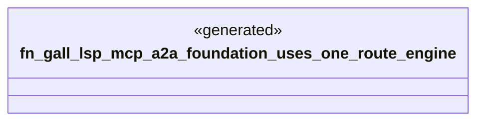

# `playground/sync-foundation/expected/gall_command_foundation.rs`

Source SHA-256: `50e6bb20b116e87e7b452dd3aa950b4ee3c829fc5d8c6396a1b3ad4cd439d1f2`

## Dependencies

- None observed.

## Standing

- Structural parse: `ALIVE`
- Runtime behavior: `UNKNOWN`
