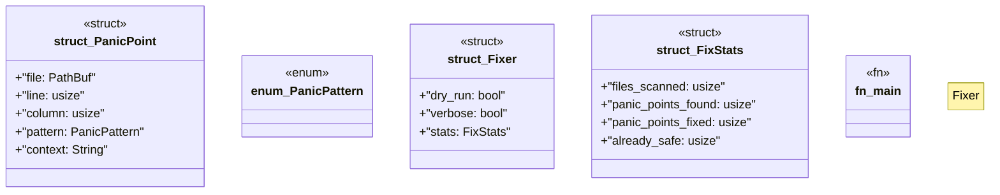

# `scripts/fix-panic-points.rs`

Source SHA-256: `c1eaa1eb042b56cbda60488c358f60639dc08270630dc11e7dcc024fa84b8d9e`

## Dependencies

- `anyhow::{Context, Result}`
- `regex::Regex`
- `std::fs`
- `std::path::{Path, PathBuf}`
- `walkdir::WalkDir`

## Standing

- Structural parse: `ALIVE`
- Runtime behavior: `UNKNOWN`
