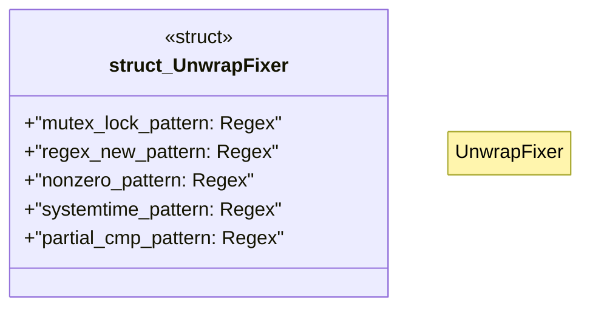

# `scripts/fix_unwrap.rs`

Source SHA-256: `44920581e87c43c9f1afeb07318964edbfca7594969939ae7c426e49b0665f98`

## Dependencies

- `regex::Regex`
- `std::fs`
- `std::path::{Path, PathBuf}`
- `walkdir::WalkDir`

## Standing

- Structural parse: `ALIVE`
- Runtime behavior: `UNKNOWN`
