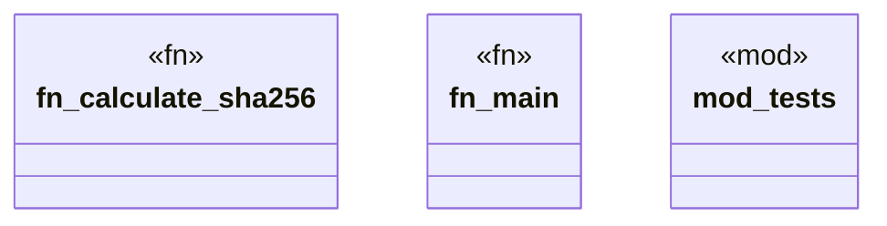

# `scripts/generate_registry_hashes.rs`

Source SHA-256: `10734323252fb868cad2f702441377f8cc899d2a045ceeede4edb526d9e06c13`

## Dependencies

- `std::collections::hash_map::DefaultHasher`
- `std::env`
- `std::fs`
- `std::hash::{Hash, Hasher}`
- `std::path::Path`
- `super::*`

## Standing

- Structural parse: `ALIVE`
- Runtime behavior: `UNKNOWN`
