# `scripts/performance_validation.rs`

Source SHA-256: `d8f65fc6e16e2ec76ad9f0797f48e859c11c5a0eb60859245c4cec9ac4fdd04f`

```mermaid
classDiagram
    class struct_BenchmarkResult {
      <<struct>>
      +"operation: String"
      +"before_avg_ms: f64"
      +"after_avg_ms: f64"
      +"improvement_percent: f64"
      +"target_percent: f64"
      +"status: String"
      +"samples: usize"
    }
    class struct_SLAMetric {
      <<struct>>
      +"operation: String"
      +"current_ms: f64"
      +"target_ms: f64"
      +"status: String"
      +"percentile: String"
    }
    class struct_ValidationReport {
      <<struct>>
      +"timestamp: String"
      +"quick_wins: Vec~BenchmarkResult~"
      +"medium_optimizations: Vec~BenchmarkResult~"
      +"sla_metrics: Vec~SLAMetric~"
      +"overall_grade: String"
      +"overall_score: u32"
    }
    class fn_main {
      <<fn>>
    }
    class fn_print_usage {
      <<fn>>
    }
    class fn_validate_quick_wins {
      <<fn>>
    }
    class fn_validate_lazy_rdf {
      <<fn>>
    }
    class fn_validate_parallel_generation {
      <<fn>>
    }
    class fn_validate_cache_improvements {
      <<fn>>
    }
    class fn_benchmark_medium_optimizations {
      <<fn>>
    }
    class fn_benchmark_lockfile_resolution {
      <<fn>>
    }
    class fn_benchmark_rdf_query_optimization {
      <<fn>>
    }
    class fn_benchmark_template_processing {
      <<fn>>
    }
    class fn_generate_sla_dashboard {
      <<fn>>
    }
    class fn_generate_full_report {
      <<fn>>
    }
    class fn_print_report_summary {
      <<fn>>
    }
    class fn_run_cargo_bench {
      <<fn>>
    }
    class fn_parse_benchmark_time {
      <<fn>>
    }
    class fn_save_benchmark_results {
      <<fn>>
    }
    class fn_save_sla_metrics {
      <<fn>>
    }
    class fn_load_benchmark_results {
      <<fn>>
    }
    class fn_load_sla_results {
      <<fn>>
    }
```

## Dependencies

- `serde::{Deserialize, Serialize}`
- `std::collections::HashMap`
- `std::fs`
- `std::path::Path`
- `std::process::Command`
- `std::time::{Duration, Instant}`

## Standing

- Structural parse: `ALIVE`
- Runtime behavior: `UNKNOWN`
