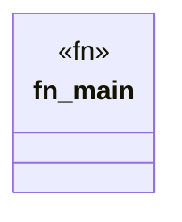

# `scripts/validate_rdf_file.rs`

Source SHA-256: `58fb45e67206bd0d438d6330cf706cc01a709a2dfd78747cb03bb47f6c85ce58`

## Dependencies

- `ggen_core::Graph`
- `std::env`
- `std::path::Path`

## Standing

- Structural parse: `ALIVE`
- Runtime behavior: `UNKNOWN`
