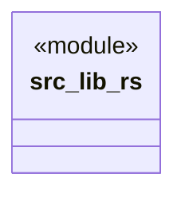

# `src/lib.rs`

Source SHA-256: `d980f314ae57be859bb2f146470721865d2c7a59c2c7be909394b41bd1c650fd`

## Dependencies

- None observed.

## Standing

- Structural parse: `ALIVE`
- Runtime behavior: `UNKNOWN`
