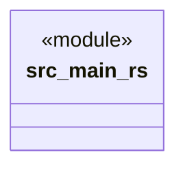

# `src/main.rs`

Source SHA-256: `3c02f78af84ca98eb52fadcd58c4583b8d38b778a91f32a7fe9bc20daa1491e5`

## Dependencies

- None observed.

## Standing

- Structural parse: `ALIVE`
- Runtime behavior: `UNKNOWN`
