# `tests/armstrong_integration.rs`

Source SHA-256: `68ef25ba827988fc2879028723feb10d846ca40fef024e94cdb20b8763f4fbbb`

```mermaid
classDiagram
    class struct_TestComponent {
      <<struct>>
      +"id: String"
      +"is_healthy: Arc~AtomicBool~"
      +"request_count: Arc~AtomicUsize~"
      +"failure_count: Arc~AtomicUsize~"
      +"restart_count: Arc~AtomicUsize~"
    }
    class struct_ComponentStats {
      <<struct>>
      +"id: String"
      +"is_healthy: bool"
      +"request_count: usize"
      +"failure_count: usize"
      +"restart_count: usize"
    }
    class struct_CircuitBreaker {
      <<struct>>
      +"failure_threshold: usize"
      +"recovery_timeout: Duration"
      +"failure_count: Arc~RwLock~usize~~"
      +"last_failure: Arc~RwLock~Option~Instant~~~"
      +"is_open: Arc~AtomicBool~"
    }
    class struct_QuorumConsensus {
      <<struct>>
      +"total_nodes: usize"
      +"max_faults: usize"
    }
    class struct_ComponentSupervisor {
      <<struct>>
      +"components: Arc~RwLock~Vec~TestComponent~~~"
      +"circuit_breakers: Arc~RwLock~Vec~CircuitBreaker~~~"
    }
    note "CircuitBreaker"
    note "Clone for CircuitBreaker"
    note "ComponentSupervisor"
    note "QuorumConsensus"
    note "TestComponent"
```

## Dependencies

- `std::sync::Arc`
- `std::sync::atomic::{AtomicBool, AtomicUsize, Ordering}`
- `std::time::{Duration, Instant}`
- `tokio::sync::RwLock`

## Standing

- Structural parse: `ALIVE`
- Runtime behavior: `UNKNOWN`
