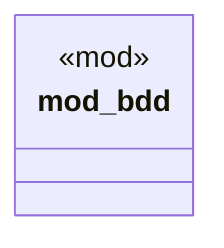

# `tests/bdd.rs`

Source SHA-256: `5fe2e9c3c93cb73c358c79be8705362cfa8f8749291e467cb5af233362741161`

## Dependencies

- `bdd::steps::*`
- `bdd::world::GgenWorld`
- `cucumber::World as _`

## Standing

- Structural parse: `ALIVE`
- Runtime behavior: `UNKNOWN`
