# `tests/bdd/steps/audit_steps.rs`

Source SHA-256: `cd581df873868653674476895fcbb05975fa0c0f47d16d9855ea60c6efd02cc1`

```mermaid
classDiagram
    class fn_have_project_with_dependencies {
      <<fn>>
    }
    class fn_have_vulnerable_dependencies {
      <<fn>>
    }
    class fn_have_performance_critical_code {
      <<fn>>
    }
    class fn_run_audit_hazard {
      <<fn>>
    }
    class fn_run_audit_performance {
      <<fn>>
    }
    class fn_run_audit_security {
      <<fn>>
    }
    class fn_run_audit_command {
      <<fn>>
    }
    class fn_should_see_hazard_report {
      <<fn>>
    }
    class fn_should_see_performance_analysis {
      <<fn>>
    }
    class fn_should_see_security_vulnerabilities {
      <<fn>>
    }
    class fn_should_see_no_vulnerabilities {
      <<fn>>
    }
    class fn_should_see_risk_assessment {
      <<fn>>
    }
    class fn_should_see_recommendations {
      <<fn>>
    }
    class fn_report_should_be_json_format {
      <<fn>>
    }
    class fn_report_should_be_html_format {
      <<fn>>
    }
    class fn_command_should_succeed {
      <<fn>>
    }
    class fn_command_should_fail {
      <<fn>>
    }
    class fn_should_see_in_output {
      <<fn>>
    }
    class fn_should_see_in_stderr {
      <<fn>>
    }
```

## Dependencies

- `assert_cmd::Command`
- `cucumber::{given, then, when}`
- `std::fs`
- `super::super::world::GgenWorld`

## Standing

- Structural parse: `ALIVE`
- Runtime behavior: `UNKNOWN`
