# `tests/bdd/steps/ci_steps.rs`

Source SHA-256: `f81dc9a8823e90089abd3aa57d9517b1632198be3498fd5e2b1df586da6a8d6a`

```mermaid
classDiagram
    class struct_EnvVarGuard {
      <<struct>>
      +"key: &'static str"
      +"previous: Option~std::ffi::OsString~"
    }
    class fn_have_github_repository {
      <<fn>>
    }
    class fn_have_github_pages_enabled {
      <<fn>>
    }
    class fn_have_github_workflow {
      <<fn>>
    }
    class fn_have_documentation_files {
      <<fn>>
    }
    class fn_have_build_artifacts {
      <<fn>>
    }
    class fn_run_ci_pages_deploy {
      <<fn>>
    }
    class fn_run_ci_pages_setup {
      <<fn>>
    }
    class fn_run_ci_trigger {
      <<fn>>
    }
    class fn_run_ci_workflow {
      <<fn>>
    }
    class fn_run_ci_command {
      <<fn>>
    }
    class fn_command_should_succeed {
      <<fn>>
    }
    class fn_command_should_fail {
      <<fn>>
    }
    class fn_should_see_deployment_status {
      <<fn>>
    }
    class fn_should_see_github_pages_url {
      <<fn>>
    }
    class fn_should_see_workflow_status {
      <<fn>>
    }
    class fn_should_see_build_logs {
      <<fn>>
    }
    class fn_should_see_setup_instructions {
      <<fn>>
    }
    class fn_workflow_should_be_triggered {
      <<fn>>
    }
    class fn_should_see_github_api_response {
      <<fn>>
    }
    class fn_output_should_be_valid_json {
      <<fn>>
    }
    class fn_should_see_in_output {
      <<fn>>
    }
    class fn_should_see_in_stderr {
      <<fn>>
    }
    note "Drop for EnvVarGuard"
    note "EnvVarGuard"
```

## Dependencies

- `assert_cmd::Command`
- `cucumber::{given, then, when}`
- `std::fs`
- `super::super::world::GgenWorld`

## Standing

- Structural parse: `ALIVE`
- Runtime behavior: `UNKNOWN`
