# `tests/bdd/steps/cli_steps.rs`

Source SHA-256: `f2318bbaba7cb529c0339f0af24e3baeb4eb09ba788d54bf23b3aaa3583dd49d`

```mermaid
classDiagram
    class fn_run_ggen_command {
      <<fn>>
    }
    class fn_run_ggen_list {
      <<fn>>
    }
    class fn_run_ggen_lint {
      <<fn>>
    }
    class fn_run_ggen_hazard {
      <<fn>>
    }
    class fn_run_ggen_completion {
      <<fn>>
    }
    class fn_run_ggen_init {
      <<fn>>
    }
    class fn_should_see_help_text {
      <<fn>>
    }
    class fn_should_see_version_info {
      <<fn>>
    }
    class fn_command_should_succeed {
      <<fn>>
    }
    class fn_should_see_available_templates {
      <<fn>>
    }
    class fn_should_see_template_metadata {
      <<fn>>
    }
    class fn_command_should_validate_template {
      <<fn>>
    }
    class fn_should_see_hazard_report {
      <<fn>>
    }
    class fn_should_see_completion_script {
      <<fn>>
    }
    class fn_should_have_basic_project_structure {
      <<fn>>
    }
    class fn_should_see_search_results {
      <<fn>>
    }
    class fn_results_should_contain {
      <<fn>>
    }
    class fn_gpack_should_be_installed {
      <<fn>>
    }
```

## Dependencies

- `assert_cmd::Command`
- `cucumber::{then, when}`
- `super::super::world::GgenWorld`

## Standing

- Structural parse: `ALIVE`
- Runtime behavior: `UNKNOWN`
