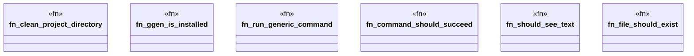

# `tests/bdd/steps/common_steps.rs`

Source SHA-256: `225d38a437658262d330756cbe8b8fea1003a30f3dff65380714ffd0ad5f5dd6`

## Dependencies

- `assert_cmd::Command`
- `cucumber::{given, then, when}`
- `std::fs`
- `super::super::world::GgenWorld`

## Standing

- Structural parse: `ALIVE`
- Runtime behavior: `UNKNOWN`
