# `tests/bdd/steps/determinism_steps.rs`

Source SHA-256: `8c69f51ae5463bbad7384d82e33152cc39c5db6b6420dfcc97ea75fcc85d4193`

```mermaid
classDiagram
    class fn_have_identical_input_files {
      <<fn>>
    }
    class fn_have_a_template {
      <<fn>>
    }
    class fn_generate_code_twice {
      <<fn>>
    }
    class fn_run_ggen_gen_with_seed {
      <<fn>>
    }
    class fn_capture_output_hash {
      <<fn>>
    }
    class fn_capture_first_output {
      <<fn>>
    }
    class fn_capture_second_output {
      <<fn>>
    }
    class fn_capture_second_output_hash {
      <<fn>>
    }
    class fn_outputs_should_be_identical {
      <<fn>>
    }
    class fn_both_output_hashes_should_be_identical {
      <<fn>>
    }
    class fn_outputs_should_be_different {
      <<fn>>
    }
    class fn_manifest_hash_should_be_computed {
      <<fn>>
    }
    class fn_same_inputs_should_produce_same_manifest_hash {
      <<fn>>
    }
    class fn_run_ggen_gen_test_template_with_seed {
      <<fn>>
    }
```

## Dependencies

- `assert_cmd::Command`
- `cucumber::{given, then, when}`
- `std::fs`
- `super::super::world::GgenWorld`

## Standing

- Structural parse: `ALIVE`
- Runtime behavior: `UNKNOWN`
