# `tests/bdd/steps/installation_steps.rs`

Source SHA-256: `16f1a70fb5a2fc5f6f0841ee3ee5e8ae187212102fbdd5320b0ea5d6d268b4cd`

```mermaid
classDiagram
    class fn_install_ggen_via_cargo {
      <<fn>>
    }
    class fn_install_ggen_via_homebrew {
      <<fn>>
    }
    class fn_clone_repository {
      <<fn>>
    }
    class fn_have_built_from_source {
      <<fn>>
    }
    class fn_run_cargo_install_ggen {
      <<fn>>
    }
    class fn_run_cargo_make_build {
      <<fn>>
    }
    class fn_run_cargo_make_install {
      <<fn>>
    }
    class fn_ggen_should_be_installed {
      <<fn>>
    }
    class fn_binary_should_exist {
      <<fn>>
    }
    class fn_should_be_in_path {
      <<fn>>
    }
    class fn_command_should_work {
      <<fn>>
    }
```

## Dependencies

- `assert_cmd::Command`
- `cucumber::{given, then, when}`
- `std::process::Command as StdCommand`
- `super::super::world::GgenWorld`

## Standing

- Structural parse: `ALIVE`
- Runtime behavior: `UNKNOWN`
