# `tests/bdd/steps/marketplace_steps.rs`

Source SHA-256: `733d886777b29350fd7a3b64864a4414c414157bc0d9f484fdbb5260ed67a9ce`

```mermaid
classDiagram
    class struct_EnvVarGuard {
      <<struct>>
      +"key: &'static str"
      +"previous: Option~std::ffi::OsString~"
    }
    class fn_marketplace_is_available {
      <<fn>>
    }
    class fn_marketplace_registry_available_at {
      <<fn>>
    }
    class fn_search_for_gpack {
      <<fn>>
    }
    class fn_run_ggen_search {
      <<fn>>
    }
    class fn_run_ggen_categories {
      <<fn>>
    }
    class fn_run_ggen_show {
      <<fn>>
    }
    class fn_run_ggen_add {
      <<fn>>
    }
    class fn_run_ggen_packs {
      <<fn>>
    }
    class fn_run_ggen_add_with_version {
      <<fn>>
    }
    class fn_have_installed_package {
      <<fn>>
    }
    class fn_have_installed_package_with_version {
      <<fn>>
    }
    class fn_run_ggen_update {
      <<fn>>
    }
    class fn_should_see_results_for_templates {
      <<fn>>
    }
    class fn_should_see_popular_categories {
      <<fn>>
    }
    class fn_should_see_package_metadata {
      <<fn>>
    }
    class fn_should_see_version_information {
      <<fn>>
    }
    class fn_should_see_description {
      <<fn>>
    }
    class fn_package_should_be_installed {
      <<fn>>
    }
    class fn_ggen_packs_should_list {
      <<fn>>
    }
    class fn_version_should_be_installed {
      <<fn>>
    }
    class fn_package_should_be_updated {
      <<fn>>
    }
    class fn_run_ggen_remove {
      <<fn>>
    }
    note "Drop for EnvVarGuard"
    note "EnvVarGuard"
```

## Dependencies

- `assert_cmd::Command`
- `cucumber::{given, then, when}`
- `std::fs`
- `super::super::world::GgenWorld`

## Standing

- Structural parse: `ALIVE`
- Runtime behavior: `UNKNOWN`
