# `tests/bdd/steps/mod.rs`

Source SHA-256: `6eb6e9b3050a6fa165ecdc5020bf03827600dd2d3ec715fe1ec2b5aa315f14ca`

```mermaid
classDiagram
    class mod_cli_steps {
      <<mod>>
    }
    class mod_common_steps {
      <<mod>>
    }
    class mod_determinism_steps {
      <<mod>>
    }
    class mod_installation_steps {
      <<mod>>
    }
    class mod_marketplace_steps {
      <<mod>>
    }
    class mod_multilang_steps {
      <<mod>>
    }
    class mod_quickstart_steps {
      <<mod>>
    }
    class mod_rdf_steps {
      <<mod>>
    }
    class mod_template_steps {
      <<mod>>
    }
    class mod_audit_steps {
      <<mod>>
    }
    class mod_ci_steps {
      <<mod>>
    }
    class mod_graph_steps {
      <<mod>>
    }
    class mod_market_noun_verb_steps {
      <<mod>>
    }
    class mod_project_steps {
      <<mod>>
    }
    class mod_template_management_steps {
      <<mod>>
    }
```

## Dependencies

- `audit_steps::*`
- `ci_steps::*`
- `cli_steps::*`
- `common_steps::*`
- `determinism_steps::*`
- `graph_steps::*`
- `installation_steps::*`
- `market_noun_verb_steps::*`
- `marketplace_steps::*`
- `multilang_steps::*`
- `project_steps::*`
- `quickstart_steps::*`
- `rdf_steps::*`
- `template_management_steps::*`
- `template_steps::*`

## Standing

- Structural parse: `ALIVE`
- Runtime behavior: `UNKNOWN`
