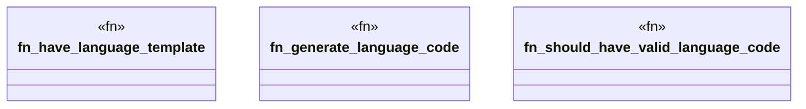

# `tests/bdd/steps/multilang_steps.rs`

Source SHA-256: `6319b35925be52c4704d4c3a84e5ff5e511c7595a1cf5f8853a420f9a9369bf7`

## Dependencies

- `assert_cmd::Command`
- `cucumber::{given, then, when}`
- `std::fs`
- `super::super::world::GgenWorld`

## Standing

- Structural parse: `ALIVE`
- Runtime behavior: `UNKNOWN`
