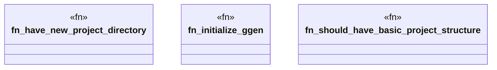

# `tests/bdd/steps/quickstart_steps.rs`

Source SHA-256: `a39664882fe06a1aea430e5a2705c77e00d4cc5e5df37ae9ba110422d1a19fad`

## Dependencies

- `assert_cmd::Command`
- `cucumber::{given, then, when}`
- `super::super::world::GgenWorld`

## Standing

- Structural parse: `ALIVE`
- Runtime behavior: `UNKNOWN`
