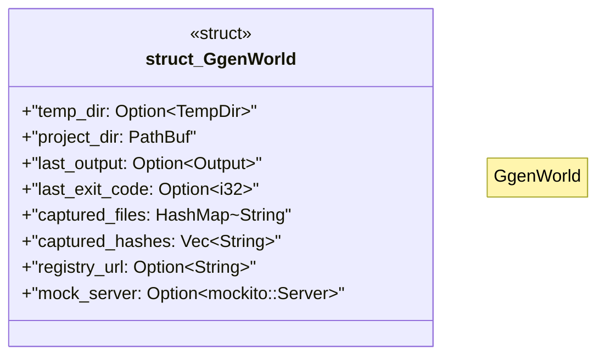

# `tests/bdd/world.rs`

Source SHA-256: `8e51f4c680bd6b5796921457f089070280cdf69697edd5cde115a0ba4232d34c`

## Dependencies

- `std::collections::HashMap`
- `std::path::PathBuf`
- `std::process::Output`
- `tempfile::TempDir`

## Standing

- Structural parse: `ALIVE`
- Runtime behavior: `UNKNOWN`
