# `tests/benchmarks/marketplace_performance.rs`

Source SHA-256: `9da46a66dfe00ce369aa57a62cbfe44777539b93cf17c1cadf184ab301d6c1ae`

```mermaid
classDiagram
    class struct_BenchmarkDataGenerator {
      <<struct>>
    }
    class fn_benchmark_search_performance {
      <<fn>>
    }
    class fn_benchmark_maturity_assessment {
      <<fn>>
    }
    class fn_benchmark_export_performance {
      <<fn>>
    }
    class fn_benchmark_comparison_performance {
      <<fn>>
    }
    class fn_benchmark_recommendation_engine {
      <<fn>>
    }
    class fn_benchmark_memory_usage {
      <<fn>>
    }
    class fn_benchmark_e2e_workflows {
      <<fn>>
    }
    class struct_MarketplacePackage {
      <<struct>>
      +"name: String"
      +"version: String"
      +"description: String"
      +"category: String"
      +"tags: Vec~String~"
      +"author: String"
      +"downloads: u64"
      +"stars: u32"
      +"forks: u32"
      +"issues: u32"
      +"pull_requests: u32"
      +"last_updated: chrono::DateTime~chrono::Utc~"
      +"license: String"
      +"repository: String"
      +"homepage: Option~String~"
      +"dependencies: Vec~String~"
      +"maturity_score: Option~f64~"
    }
    class struct_SearchQuery {
      <<struct>>
      +"text: String"
      +"category: Option~String~"
      +"tags: Vec~String~"
      +"min_stars: Option~u32~"
      +"max_results: Option~usize~"
    }
    class struct_UserPreferences {
      <<struct>>
      +"categories: Vec~String~"
      +"min_stars: u32"
      +"min_maturity_score: Option~f64~"
      +"max_results: usize"
    }
    class fn_search_packages {
      <<fn>>
    }
    class fn_search_by_category {
      <<fn>>
    }
    class fn_search_by_tags {
      <<fn>>
    }
    class fn_advanced_search {
      <<fn>>
    }
    class fn_assess_maturity {
      <<fn>>
    }
    class fn_batch_assess_maturity {
      <<fn>>
    }
    class fn_parallel_assess_maturity {
      <<fn>>
    }
    class fn_export_to_csv {
      <<fn>>
    }
    class fn_export_to_json {
      <<fn>>
    }
    class fn_export_to_html {
      <<fn>>
    }
    class fn_export_to_markdown {
      <<fn>>
    }
    class fn_compare_packages {
      <<fn>>
    }
    class fn_detailed_compare_packages {
      <<fn>>
    }
    class fn_generate_recommendations {
      <<fn>>
    }
    class fn_ml_generate_recommendations {
      <<fn>>
    }
    class fn_rank_packages {
      <<fn>>
    }
    note "BenchmarkDataGenerator"
```

## Dependencies

- `criterion::{black_box, criterion_group, criterion_main, Criterion, BenchmarkId, Throughput}`
- `ggen_marketplace::*`
- `rayon::prelude::*`
- `serde_json::json`
- `std::collections::HashMap`
- `std::time::Duration`

## Standing

- Structural parse: `ALIVE`
- Runtime behavior: `UNKNOWN`
