# `tests/benchmarks/performance_analysis.rs`

Source SHA-256: `46f9709940c4c3df44f0c02f66afe11942b7e2e9f7811bf887ce1c36e3ec3234`

```mermaid
classDiagram
    class struct_BenchmarkResult {
      <<struct>>
      +"command: String"
      +"dataset_size: usize"
      +"mean_time_ms: f64"
      +"median_time_ms: f64"
      +"p95_time_ms: f64"
      +"p99_time_ms: f64"
      +"throughput: f64"
      +"memory_usage_mb: f64"
      +"success_rate: f64"
    }
    class struct_PerformanceGoals {
      <<struct>>
      +"interactive_max_ms: f64"
      +"report_max_ms: f64"
      +"memory_max_mb: f64"
      +"min_success_rate: f64"
    }
    class struct_OptimizationRecommendation {
      <<struct>>
      +"severity: Severity"
      +"command: String"
      +"issue: String"
      +"current_performance: String"
      +"target_performance: String"
      +"recommendations: Vec~String~"
      +"estimated_improvement: String"
    }
    class enum_Severity {
      <<enum>>
    }
    class struct_PerformanceAnalyzer {
      <<struct>>
      +"goals: PerformanceGoals"
      +"results: Vec~BenchmarkResult~"
    }
    class struct_AnalysisReport {
      <<struct>>
      +"summary: PerformanceSummary"
      +"goals: PerformanceGoals"
      +"recommendations: Vec~OptimizationRecommendation~"
      +"baseline_metrics: BaselineMetrics"
      +"performance_trends: PerformanceTrends"
    }
    class struct_PerformanceSummary {
      <<struct>>
      +"total_benchmarks: usize"
      +"commands_tested: usize"
      +"command_summaries: Vec~CommandSummary~"
    }
    class struct_CommandSummary {
      <<struct>>
      +"command: String"
      +"samples: usize"
      +"avg_latency_ms: f64"
      +"min_latency_ms: f64"
      +"max_latency_ms: f64"
      +"avg_memory_mb: f64"
      +"avg_throughput: f64"
    }
    class struct_BaselineMetrics {
      <<struct>>
      +"median_latency_ms: f64"
      +"p95_latency_ms: f64"
      +"p99_latency_ms: f64"
      +"median_memory_mb: f64"
      +"median_throughput: f64"
    }
    class struct_PerformanceTrends {
      <<struct>>
      +"scaling_analysis: Vec~ScalingAnalysis~"
    }
    class struct_ScalingAnalysis {
      <<struct>>
      +"command: String"
      +"min_dataset_size: usize"
      +"max_dataset_size: usize"
      +"scaling_factor: f64"
      +"estimated_complexity: String"
    }
    class mod_tests {
      <<mod>>
    }
    note "AnalysisReport"
    note "Default for PerformanceGoals"
    note "PerformanceAnalyzer"
```

## Dependencies

- `serde::{Deserialize, Serialize}`
- `std::collections::HashMap`
- `std::fs`
- `std::path::Path`
- `super::*`

## Standing

- Structural parse: `ALIVE`
- Runtime behavior: `UNKNOWN`
