# `tests/chaos/correlation.rs`

Source SHA-256: `f0f4d0f3c10baa384ad2eaea93204eed21eed30061c8b8fcf356755d0dc69b21`

```mermaid
classDiagram
    class struct_CorrelationId {
      <<struct>>
    }
    class struct_TraceEntry {
      <<struct>>
      +"correlation_id: CorrelationId"
      +"timestamp_millis: u64"
      +"component: String"
      +"operation: String"
      +"start_ns: u128"
      +"end_ns: Option~u128~"
      +"parent_span: Option~String~"
      +"status: TraceStatus"
      +"metadata: HashMap~String"
    }
    class enum_TraceStatus {
      <<enum>>
    }
    class struct_CorrelationContext {
      <<struct>>
      +"correlation_id: CorrelationId"
      +"traces: Arc~Mutex~Vec~TraceEntry~~~"
    }
    class struct_SpanGuard {
      <<struct>>
      +"traces: Arc~Mutex~Vec~TraceEntry~~~"
      +"span_id: usize"
    }
    class fn_current_time_millis {
      <<fn>>
    }
    class fn_current_time_nanos {
      <<fn>>
    }
    class mod_tests {
      <<mod>>
    }
    note "Clone for CorrelationContext"
    note "CorrelationContext"
    note "CorrelationId"
    note "Default for CorrelationContext"
    note "Default for CorrelationId"
    note "Drop for SpanGuard"
    note "SpanGuard"
    note "TraceEntry"
    note "fmt::Display for CorrelationId"
```

## Dependencies

- `std::collections::HashMap`
- `std::fmt`
- `std::sync::Arc`
- `std::sync::Mutex`
- `std::time::{SystemTime, UNIX_EPOCH}`
- `super::*`
- `uuid::Uuid`

## Standing

- Structural parse: `ALIVE`
- Runtime behavior: `UNKNOWN`
