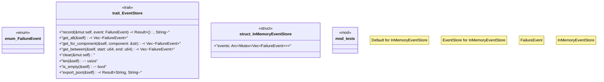

# `tests/chaos/event_store/mod.rs`

Source SHA-256: `17b3a8c37e7320a03705e47bf5fea3a1fa1aab5958c404f20a949907236a17f8`

## Dependencies

- `serde::{Deserialize, Serialize}`
- `std::collections::HashMap`
- `std::sync::{Arc, Mutex}`
- `std::time::Duration`
- `super::*`

## Standing

- Structural parse: `ALIVE`
- Runtime behavior: `UNKNOWN`
