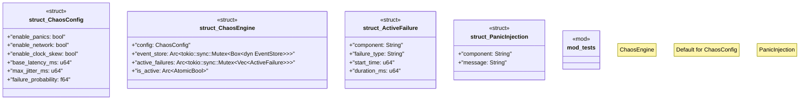

# `tests/chaos/injection/mod.rs`

Source SHA-256: `ae7d0d2b8682713f1c3835b2b579ecdcd0720690fea93dcd5e1c5e34a93098a5`

## Dependencies

- `crate::chaos::event_store::{EventStore, FailureEvent, InMemoryEventStore}`
- `rand::Rng`
- `std::sync::Arc`
- `std::sync::atomic::{AtomicBool, Ordering}`
- `std::time::Duration`
- `super::*`
- `tokio::time::sleep`

## Standing

- Structural parse: `ALIVE`
- Runtime behavior: `UNKNOWN`
