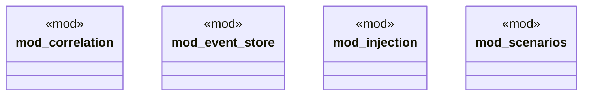

# `tests/chaos/mod.rs`

Source SHA-256: `fb0683608046dfad6dc6d290a3d097a4e29e202cc079906a4013ba0763f57ef0`

## Dependencies

- `correlation::{CorrelationId, CorrelationContext}`
- `event_store::{FailureEvent, EventStore, InMemoryEventStore}`
- `injection::{ChaosEngine, ChaosConfig, PanicInjection}`
- `scenarios::{ ChaosScenario, PanicInjectionScenario, NetworkChaosScenario, ClockSkewScenario, CascadingFailureScenario, RecoveryScenario, }`

## Standing

- Structural parse: `ALIVE`
- Runtime behavior: `UNKNOWN`
