# `tests/chaos/scenarios/mod.rs`

Source SHA-256: `f1f95976c34c28590929679bdd1c2c6d1bfbdbb4b042bddce185038e57614598`

```mermaid
classDiagram
    class trait_ChaosScenario {
      <<trait>>
      +"name(&self) -~ &str"
      +"description(&self) -~ &str"
      +"run(&self) -~ ScenarioResult"
      +"verify(&self) -~ VerificationResult"
    }
    class struct_ScenarioResult {
      <<struct>>
      +"scenario_name: String"
      +"success: bool"
      +"duration_ms: u64"
      +"events_recorded: usize"
      +"error_message: Option~String~"
    }
    class struct_VerificationResult {
      <<struct>>
      +"passed: bool"
      +"checks: Vec~String~"
      +"failed_checks: Vec~String~"
    }
    class struct_PanicInjectionScenario {
      <<struct>>
      +"chaos: Arc~ChaosEngine~"
      +"context: CorrelationContext"
    }
    class struct_NetworkChaosScenario {
      <<struct>>
      +"chaos: Arc~ChaosEngine~"
      +"context: CorrelationContext"
    }
    class struct_ClockSkewScenario {
      <<struct>>
      +"chaos: Arc~ChaosEngine~"
      +"context: CorrelationContext"
    }
    class struct_CascadingFailureScenario {
      <<struct>>
      +"chaos: Arc~ChaosEngine~"
      +"context: CorrelationContext"
    }
    class struct_RecoveryScenario {
      <<struct>>
      +"chaos: Arc~ChaosEngine~"
      +"context: CorrelationContext"
    }
    class mod_tests {
      <<mod>>
    }
    note "CascadingFailureScenario"
    note "ChaosScenario for CascadingFailureScenario"
    note "ChaosScenario for ClockSkewScenario"
    note "ChaosScenario for NetworkChaosScenario"
    note "ChaosScenario for PanicInjectionScenario"
    note "ChaosScenario for RecoveryScenario"
    note "ClockSkewScenario"
    note "Default for CascadingFailureScenario"
    note "Default for ClockSkewScenario"
    note "Default for NetworkChaosScenario"
    note "Default for PanicInjectionScenario"
    note "Default for RecoveryScenario"
    note "NetworkChaosScenario"
    note "PanicInjectionScenario"
    note "RecoveryScenario"
```

## Dependencies

- `crate::chaos::correlation::CorrelationContext`
- `crate::chaos::event_store::FailureEvent`
- `crate::chaos::injection::{ChaosConfig, ChaosEngine}`
- `std::sync::Arc`
- `std::time::Duration`
- `super::*`
- `tokio::sync::Mutex`

## Standing

- Structural parse: `ALIVE`
- Runtime behavior: `UNKNOWN`
