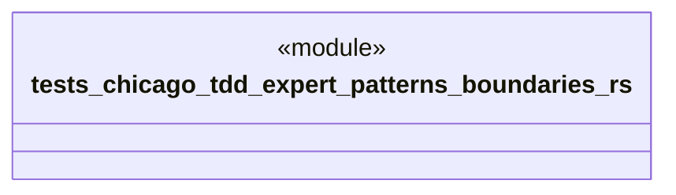

# `tests/chicago_tdd/expert_patterns/boundaries.rs`

Source SHA-256: `259802c0978f1479dea9d5326fac17e68925d00cda56442b01428a03bee7c604`

## Dependencies

- `chicago_tdd_tools::prelude::*`
- `ggen_core::graph::Graph`
- `std::path::PathBuf`

## Standing

- Structural parse: `ALIVE`
- Runtime behavior: `UNKNOWN`
