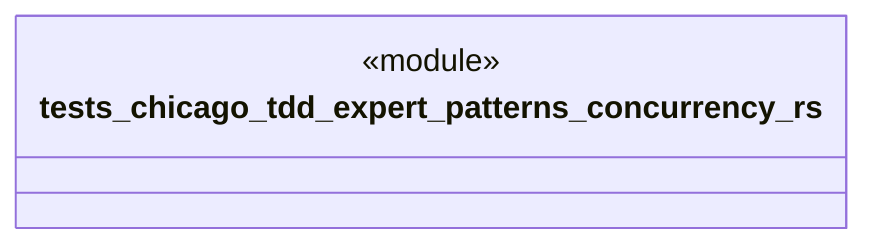

# `tests/chicago_tdd/expert_patterns/concurrency.rs`

Source SHA-256: `48d0a66f0b3c44fc33d11cae9653b478fe8d17f68abce1a8715ec751c7804de0`

## Dependencies

- `chicago_tdd_tools::prelude::*`
- `ggen_core::graph::Graph`
- `std::sync::atomic::{AtomicU64, AtomicUsize, Ordering}`
- `std::sync::{Arc, Mutex}`
- `std::thread`
- `std::time::Duration`

## Standing

- Structural parse: `ALIVE`
- Runtime behavior: `UNKNOWN`
