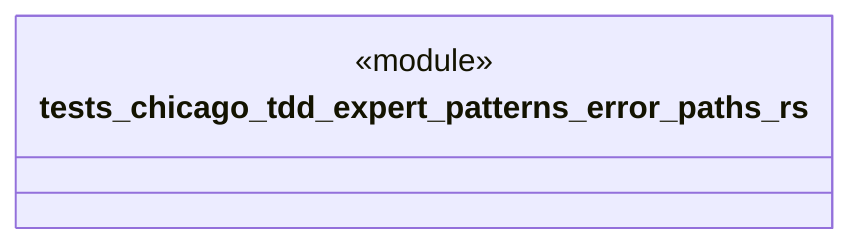

# `tests/chicago_tdd/expert_patterns/error_paths.rs`

Source SHA-256: `58b907812521e931b01bb24668d243907af75df2b3b43d02be23905ca994752a`

## Dependencies

- `chicago_tdd_tools::prelude::*`
- `ggen_core::graph::Graph`
- `ggen_core::utils::error::Result`
- `std::path::PathBuf`

## Standing

- Structural parse: `ALIVE`
- Runtime behavior: `UNKNOWN`
