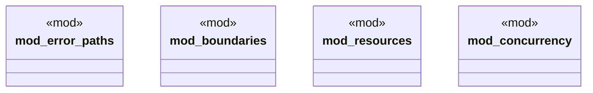

# `tests/chicago_tdd/expert_patterns/mod.rs`

Source SHA-256: `a0b268229d6070bb2ffe28764396f7da004cee7466e9beefd5b4125fb6d1dd07`

## Dependencies

- None observed.

## Standing

- Structural parse: `ALIVE`
- Runtime behavior: `UNKNOWN`
