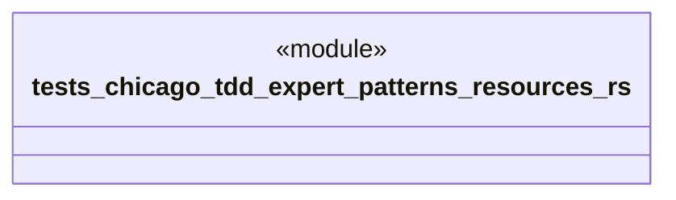

# `tests/chicago_tdd/expert_patterns/resources.rs`

Source SHA-256: `282128ddc4bd487a6c1d3be44b8b9b19d475591fa7c8fd69663a45023a8a4db9`

## Dependencies

- `chicago_tdd_tools::prelude::*`
- `ggen_core::graph::Graph`
- `std::sync::atomic::{AtomicUsize, Ordering}`
- `std::sync::{Arc, Mutex}`
- `tempfile::TempDir`

## Standing

- Structural parse: `ALIVE`
- Runtime behavior: `UNKNOWN`
